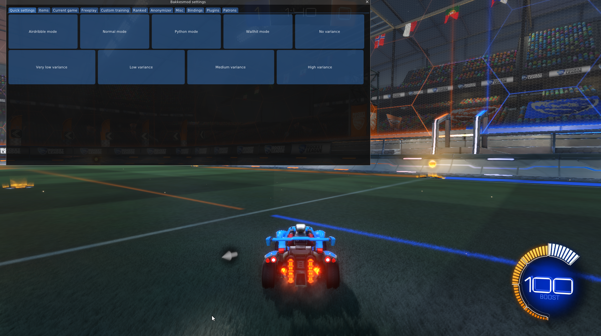

# Implement a basic bot that drives straight #2

## Summary

I tried to install RLGym using Poetry, but I couldn't do it due to version conflicts between the libraries. Therefore, for now, I decided to complete my task in a local project, and I placed my code in the file `script_for_drives_straight.py`.
To run the bot, you need to install BakkesMod, and during the installation of RLGym, BakkesMod should also be running.

## Image from test

