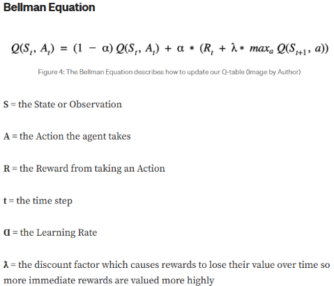
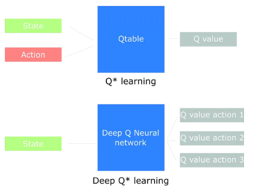

# Deep Q Network

***Theoretical Background:***

Q-learning is a basic reinforcement learning algorithm. It is model-free (meaning it doesn’t need a model of the environment), off-policy (it learns regardless of the strategy we follow), and value-based. Q-learning uses a Q-table to store and update values for each state-action pair. These values are updated using the Bellman equation. What’s interesting is that the Bellman equation doesn’t rely on the previous state but instead uses the current state and the estimated value of the next state.

*Image created by:Mike Wang*

A major issue with Q-learning is that the Q-table method becomes impractical when there are too many states and actions to calculate. In such cases, the table can grow too large.

The solution to this problem is Deep Q-learning (DQL), which is an extension of Q-learning that uses a neural network instead of a Q-table. The difference is that in Q-learning, the Q-table gives us simple values, but in DQL, the neural network outputs action-value pairs.

*Image created by:Sergios Karagiannakos*

Deep Q-Network (DQN) refers to the neural network used in DQL to approximate Q-values. This helps in handling environments with large or continuous state spaces, making decision-making more efficient.

***Implementation:***  
Here you can read about the main steps to create basic DQN.

**DQN Step-by-Step algorithm**  

1. **Create Policy Neural Network:**  
   Start by defining the policy network, which is a neural network responsible for approximating the Q-values for a given state-action pair. The network takes the current state as input and outputs a Q-value for each possible action in that state.  
2. **Create Target Network:**  
   Copy the policy network to create the target network.  
   * This is a copy of the policy network that is updated periodically to help stabilize the learning process. By using a fixed target network, we reduce the risk of overestimating Q-values, which can occur when both the predicted and target Q-values are updated simultaneously.  
   * The target network is synchronized with the policy network after a fixed number of steps.  
3. **Action Selection with Epsilon-Greedy Exploration:**  
   During training, the agent chooses actions using an epsilon-greedy strategy:  
   * With probability epsilon (𝜖), the agent selects a random action.  
   * With probability (1 – epsilon), the agent selects the action with the highest Q-value predicted by the policy network.  
   * As training progresses, epsilon is gradually reduced to encourage more exploitation over time.  
4. **Store Experiences in Replay Buffer:**  
   After every action, store the experience in a replay buffer (also called experience replay).  
   * Each experience consists of a tuple (state, action, reward, next state, done), representing a single step from one state to another as a result of taking a specific action.  
   * Replay Memory is a buffer that allows the agent to store and randomly sample mini-batches of experiences to break the correlation between consecutive transitions. It helps improve the stability and convergence of the learning process.  
5. **Put Information into the Policy Network:**  
   Sample a mini-batch of experiences from the replay buffer and input the current state (s) into the policy network. The policy network will output the predicted Q-values for all actions in that state.  
6. **Obtain Q-value from Target Network:**  
   For each experience in the mini-batch, pass the next state (s') through the target network to get the Q-value for the next state. Use these Q-values to compute the target Q-value.  
7. **Calculate the Target Q-value using the Bellman Equation**  
   The target Q-value (ideal reward) is calculated using the Bellman equation:

   $$
   Q_{\text{target}}(s, a) = r + \gamma \max_{a'} Q_{\text{target}}(s', a')
   $$

   where:

   * \( r \) is the reward received after taking action \( a \) in state \( s \),
   * \( \gamma \) is the discount factor that accounts for future rewards,
   * \( \max_{a'} Q_{\text{target}}(s', a') \) is the maximum Q-value for the next state \( s' \) as predicted by the target network.

8. **Compute the Loss and Backpropagate**  
   The loss is calculated as the mean squared error between the predicted Q-values from the policy network and the target Q-values from the target network:

   $$
   \text{Loss} = \frac{1}{N} \sum_{i=1}^{N} \left( Q_{\text{predicted}}(s_i, a_i) - Q_{\text{target}}(s_i, a_i) \right)^2
   $$

   * Use this loss to perform backpropagation and update the weights of the policy network using stochastic gradient descent.

9. **Train the Policy Network:**  
   The policy network is updated to minimize the difference between the predicted Q-values and the target Q-values, ensuring that it learns to make better action-value predictions over time.  
10. **Repeat Steps 3-8:**  
    Continue the process by repeating steps 3 through 8:  
    * Select actions using epsilon-greedy.  
    * Store experiences in the replay buffer.  
    * Sample mini-batches, calculate the loss, and update the policy network.  
11. **Synchronize Policy and Target Networks:**  
    After a fixed number of steps (usually after several episodes or steps), synchronize the target network with the policy network by copying the weights from the policy network to the target network. This keeps the target network up to date, but prevents it from changing too frequently.

**Recommend to watch this video:**  
[**https://youtu.be/EUrWGTCGzlA?si=67Bblssy8OYbeTwJ**](https://youtu.be/EUrWGTCGzlA?si=67Bblssy8OYbeTwJ)

**Exemples of impementation:**  
[**cleanrl/cleanrl/dqn\_atari.py at master · vwxyzjn/cleanrl (github.com)**](https://github.com/vwxyzjn/cleanrl/blob/master/cleanrl/dqn_atari.py)  
[**RLAlgorithms/DQN\_From\_Scratch\_Atari.ipynb at main · JayBaileyCS/RLAlgorithms (github.com)**](https://github.com/JayBaileyCS/RLAlgorithms/blob/main/DQN_From_Scratch_Atari.ipynb)

***Problems and solutions:***

A common problem when using neural networks in reinforcement learning is maintaining stability during the training process. To address this issue, we can use **Double DQN**. This approach involves using two DQNs: one is a copy of the network, which is used to generate the predicted term, and the second one is the actual DQN used for training, responsible for generating the target term. This method helps to stabilize training and improves the accuracy of the Q-values, particularly during the early stages.

Another common challenge is tuning the correct hyperparameters for the neural network. Some key parameters include:

* **Epsilon value**: It's better to start with a smaller epsilon to prevent the model from excessive exploration before the exploitation phase begins.  
* **Learning rate**: It should not be too large in order to slow down the learning process, which helps in stabilizing the training.  
* **Memory size**: The replay memory should be large enough to store sufficient experiences for effective learning.

**Here you can read how different parameters can be involved in results:**  
[**Solving Lunar Lander with Double Dueling Deep Q-Network and PyTorch (drawar.github.io)**](https://drawar.github.io/blog/2019/05/12/lunar-lander-dqn.html)

***Resources:***

First time using:  
[1312.5602 (arxiv.org)](https://arxiv.org/pdf/1312.5602)  
[1711.07478 (arxiv.org)](https://arxiv.org/pdf/1711.07478)

Foundation about RL:  
[The secrets behind Reinforcement Learning | by Sergios Karagiannakos | Towards Data Science](https://towardsdatascience.com/the-secrets-behind-reinforcement-learning-25b87befb2d3)

Foundation about Q-learning:  
[Q Learning and Deep Q Networks. The journey to Reinforcement learning… | by Sergios Karagiannakos | Towards Data Science](https://towardsdatascience.com/q-learning-and-deep-q-networks-436380e8396a)

Compera to Policy Gradient:  
[Deep Q Network vs Policy Gradients \- An Experiment on VizDoom with Keras | Felix Yu (flyyufelix.github.io)](https://flyyufelix.github.io/2017/10/12/dqn-vs-pg.html)

Useful repo:  
[RLgym/DQN/DQNtest.py at master · curefate/RLgym (github.com)](https://github.com/curefate/RLgym/blob/master/DQN/DQNtest.py)  
[RL-Gym-PyTorch/CartPole/DQN at main · lexiconium/RL-Gym-PyTorch (github.com)](https://github.com/lexiconium/RL-Gym-PyTorch/tree/main/CartPole/DQN)  
[**deep-learning/reinforcement/Q-learning-cart.ipynb at master · udacity/deep-learning (github.com)**](https://github.com/udacity/deep-learning/blob/master/reinforcement/Q-learning-cart.ipynb)  
