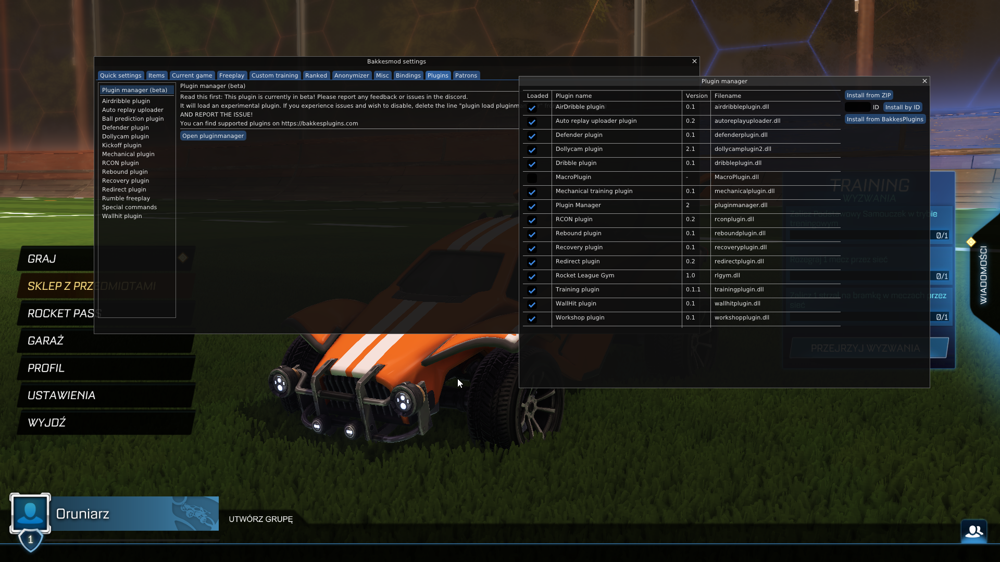
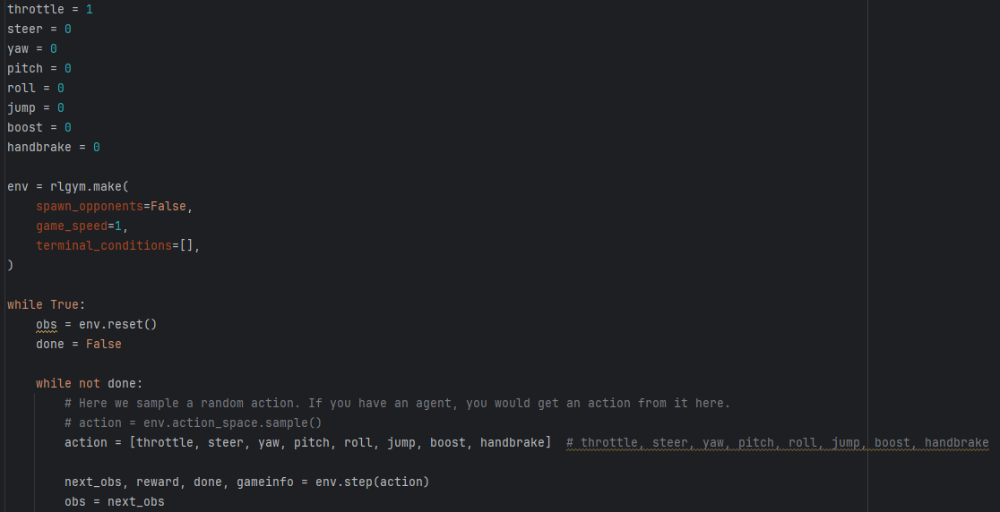

# Installing packages
I had a problem installing packages using poetry, so I tried to create a new project
and install it there. At first, it didn't work but after some googling I found out that
I need to install numpy and all the packages used by rlgym independently even though 
they should be installed while installing RLGym (pip install psutil pywinauto gym cloudpickle gym-notices importlib-metadata pywin32 six comtypes zipp).
Also, BakkesMod needed to be updated to the latest version. After all of that, I could finally install RLGym and test the script.  
I was using Python 3.9.13 and Windows 10 Home.

# Running script
In order to run the bot, "Rocket League Gym" option inside BakkesMod need to be checked while the game is running: 
  
After that, python script can be launched directly from the IDE.

# Script content
Inside the [simple_bot_riding_straight.py](../assets/code_snippets/simple_bot_riding_straight.py) there are some additional
lines of code that are not used because I was testing different options that the bot can be run with. I left them because
they might come in handy. The main part of the script was mostly copied from official documentation with some minor changes:  
  
"rlgym.make" function is responsible for creating and configuring a Rocket League environment and spawning bots in RLGym.
Here it is run with no opponents, game speed set to 1 and with no terminal conditions so the match doesn't
reset.
"env.step(action)" function is responsible for telling bot what to do each step of the game. "action" is a list
of all possible bot's actions with only "throttle" set to 1, so it can drive forward indefinitely.